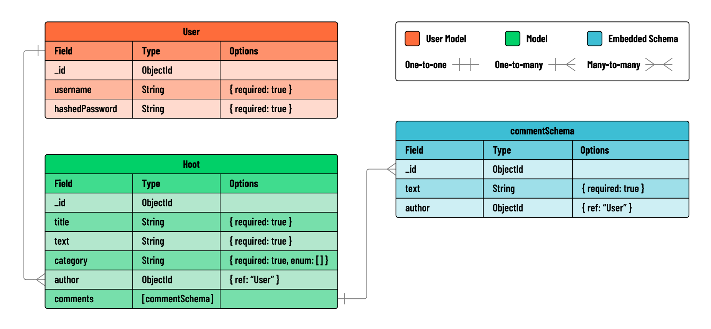

# Project 3 -> Hoot

## Repo

2 repos

- front-end -> React
  - netlify / vercel
- back-end -> Express
  - render.com
  - base off the jwt auth template
- database
  - mongodb atlas

## Planning

- user stories
- wireframes
- model

## MVP User Stories

Make sure you have CRUD

- As a guest, I should be able to create an account.
- As a new user with an account, I should be able to log in to my account.
- As a user, I should be able to **Create** a hoot post.
- As a user, I should be able to see a **list** of all hoots on a ‘List’ page.
- As a user, clicking on a hoot in the ‘List’ page should navigate me to a hoot’s **‘Details’** page to view information about a single hoot post and its associated comments.
- As a user, I should be able to add a comment on a hoot’s ‘Details’ page.
- As the author of a hoot, I should see a link to **‘Edit’** a hoot on the ‘Details’ page. Clicking on the link should direct me to an ‘Edit’ page where I can modify the hoot. Upon submitting the update, I should be redirected back to the ‘Details’ page.
- As the author of a hoot, I should see a button to **‘Delete’** a hoot on the ‘Details’ page. Clicking the button should delete the hoot and redirect me back to the ‘List’ page.

## Wireframe

### React Router

RESTful routes

| URI                     | Use Case              |
| ----------------------- | --------------------- |
| /hoots/new              | Form to create a hoot |
| /hoots                  | List hoots            |
| /hoots/:hootId          | Get a single hoot     |
| /hoots/:hootId          | Update a hoot         |
| /hoots/:hootId          | Delete a hoot         |
| /hoots/:hootId/comments | Create a comment      |

### Components

- Pages -> Components with Routes
- Components

  - State / Props?
  - Fetch Data
    - onload -> useEffect
    - onClick

- Forms -> Controlled Forms

- Services -> API

## Model -> ERD

2 (Hoot, Comments -> Embedded) + 1 (User)

In lieu of ERD -> Google Sheet

### User

| id  | username | password |
| --- | -------- | -------- |
| SSS | simon    | 123      |
| KKK | kristie  | 888      |

### Hoot

| id  | title        | text                           | category | author | comments |
| --- | ------------ | ------------------------------ | -------- | ------ | -------- |
| 111 | Learn JWT    | I am having problems with this | tech     | SSS    |          |
| 222 | Eat Lunch    | Want to eat sushi              | food     | KKK    |          |
| 333 | Learn Python | learn new stuff                | tech     | SSS    |          |

### API Routes

| HTTP Method | Controller    | Response | URI                     | Use Case          |
| ----------- | ------------- | -------- | ----------------------- | ----------------- |
| POST        | create        | 201, 400 | /hoots                  | Create a hoot     |
| GET         | index         | 200      | /hoots                  | List hoots        |
| GET         | show          | 200, 404 | /hoots/:hootId          | Get a single hoot |
| PUT         | update        | 200      | /hoots/:hootId          | Update a hoot     |
| DELETE      | deleteHoot    | 200      | /hoots/:hootId          | Delete a hoot     |
| POST        | createComment | 200      | /hoots/:hootId/comments | Create a comment  |

Do all the above in Bruno / Postman
